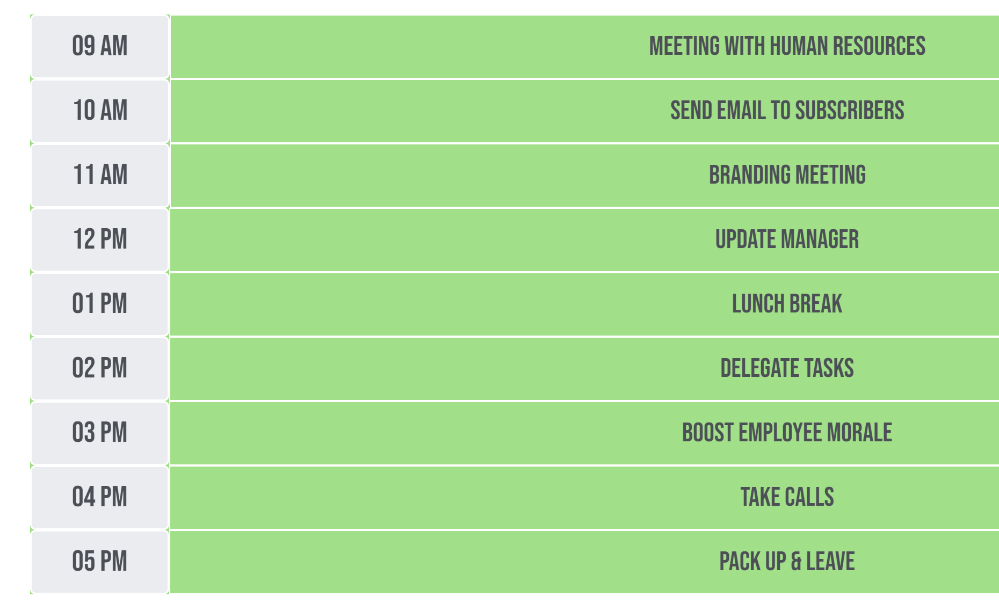

# Day Planner

This is a <strong>day planner</strong> that helps you organize your tasks for a working day. It is a simple calendar app that you can use to schedule your activities. It has time boxes set for standard work hours <strong>(9AM - 5PM)</strong> and users can add notes and reminders for tasks they need to do throughout the day.

 

# Deployed link

The following link will take you to the planner:   
<a href= "https://moecancode.github.io/Day-Planner/">Day-Planner</a>

 

# Layout

The webpage has a layout that has two main sections: A <strong>jumbotron</strong> and the <strong>calendar</strong> itself. The date for the day is displayed on the jumbotron and the calendar is a table that has 9 rows for 9 hours.

 

 

# Working

Users can edit the text boxes to add tasks for different times of the day. Once the desired input is typed in, users have to press save to commit their text input to <strong>local storage</strong>. This ensures that the tasks will still be there to see when the page is reloaded.

 

 

The time boxes are <strong>color-coded</strong> to represent the time in the past, present and future. Users can easily understand what task was set to be done at what time of the day. 

 

 

As you can see, all tasks that have been saved will be accessible whenever the user visits the website. If a task needs to be changed, it can be easily edited and saved using the corresponding <strong>save button</strong>.

 

 

# Contributors

**Mohammad Abuzar Razvi**

 

# License

MIT License

Copyright (c) [2022] [Mohammad Abuzar Razvi]

Permission is hereby granted, free of charge, to any person obtaining a copy
of this software and associated documentation files (the "Software"), to deal
in the Software without restriction, including without limitation the rights
to use, copy, modify, merge, publish, distribute, sublicense, and/or sell
copies of the Software, and to permit persons to whom the Software is
furnished to do so, subject to the following conditions:

The above copyright notice and this permission notice shall be included in all
copies or substantial portions of the Software.

THE SOFTWARE IS PROVIDED "AS IS", WITHOUT WARRANTY OF ANY KIND, EXPRESS OR
IMPLIED, INCLUDING BUT NOT LIMITED TO THE WARRANTIES OF MERCHANTABILITY,
FITNESS FOR A PARTICULAR PURPOSE AND NONINFRINGEMENT. IN NO EVENT SHALL THE
AUTHORS OR COPYRIGHT HOLDERS BE LIABLE FOR ANY CLAIM, DAMAGES OR OTHER
LIABILITY, WHETHER IN AN ACTION OF CONTRACT, TORT OR OTHERWISE, ARISING FROM,
OUT OF OR IN CONNECTION WITH THE SOFTWARE OR THE USE OR OTHER DEALINGS IN THE
SOFTWARE.